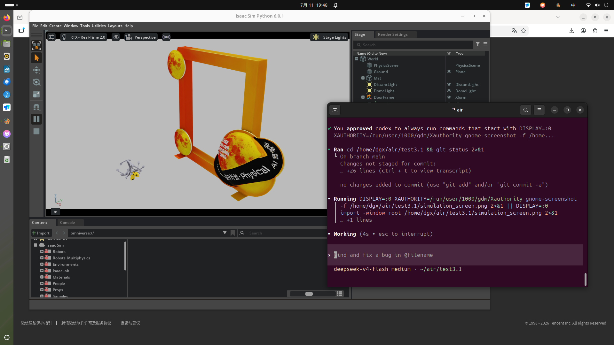

# AirSweepRobot — Isaac Sim 仿真场景 (test3.1)

> DGX 工作站 (aarch64, GB10/Tegra iGPU) 上运行的 Isaac Sim 仿真场景。
> 机械臂无人机抓取 + 门框场景，用于清洁操作的仿真验证。

---

## 场景内容

| 元素 | 位置 | 说明 |
|------|------|------|
| 机械臂无人机 `drone_with_arm` | (0, 0, 0) | URDF 导入，6 个关节驱动 (shoulder_pan/lift, elbow_flex, wrist_flex/roll, gripper) |
| 门框 | (1, 1, 0) | USDZ 模型，模拟清洁操作的目标结构 |
| 地面 | Y=0 | 物理碰撞平面，灰色材质 |
| 光照 | - | 平行光 600 + 穹顶光 400 |

物理引擎使用 PhysX，重力 9.81 m/s²，仿真以 ~19 fps 运行。

---

## 环境要求

- **硬件**: NVIDIA DGX (aarch64, GB10/Tegra iGPU)
- **系统**: Linux，已安装 NVIDIA 驱动
- **Docker**: 支持 `--runtime=nvidia`（NVIDIA Container Toolkit）
- **显示**: 本地物理显示器接在 `:0`

---

## 快速启动

### 1. 拉取镜像

```bash
docker pull nvcr.io/nvidia/isaac-sim:6.0.1
```

也可使用预构建的自定义镜像:

```bash
docker pull isaac-sim-torch:6.0.1
```

### 2. 启动仿真

```bash
cd /home/dgx/air/test3.1
bash launch_3_1.sh
```

### 3. 查看日志

```bash
docker logs -f isaac_clean_3_1
```

### 4. 停止容器

```bash
docker stop isaac_clean_3_1
```

---

## 启动后的界面



---

## 文件说明

| 文件 | 说明 |
|------|------|
| `launch_3_1.sh` | Docker 容器启动脚本，挂载当前目录并运行 Isaac Sim |
| `clean_scene_3_1.py` | 主仿真脚本：构建场景、导入 URDF/USDZ、启动物理仿真 |
| `blander/` | 模型资产目录（URDF、USDZ、网格文件） |
| `Dockerfile.clean_rl` | 清洁场景 RL 镜像构建文件 |
| `simulation_screen.png` | 仿真运行时的屏幕截图 |

---

## 仿真脚本功能

`clean_scene_3_1.py` 使用 `isaacsim.SimulationApp` API 完成:

1. 创建物理场景（重力、地面、光照）
2. 导入门框 USDZ 模型到 (1, 1, 0)
3. 通过 URDFImporter 导入 `drone_with_arm` 机械臂无人机到原点
4. 配置 6 个关节的力驱动（stiffness/damping）
5. 启动物理仿真，20 Hz 更新循环
6. 每 150 帧打印状态日志

---

## Conda 环境

如需在 conda 中直接运行（不通过 Docker）:

```bash
conda run -n 3.1 python /workspace/clean_scene_3_1.py
```

注意：需要 `isaacsim` 包安装在对应 conda 环境中。
